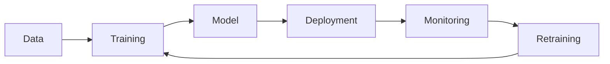
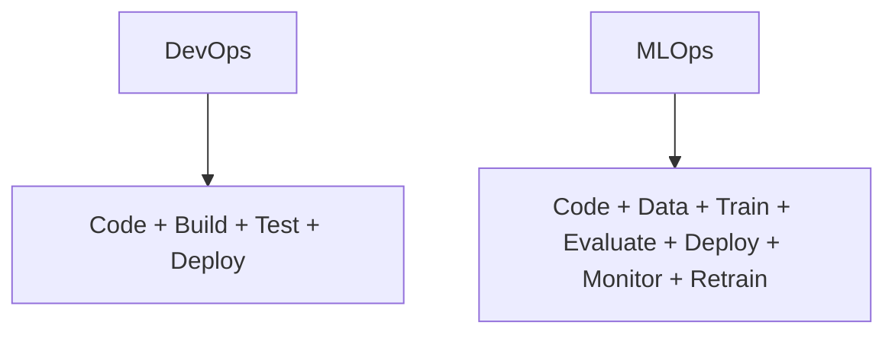
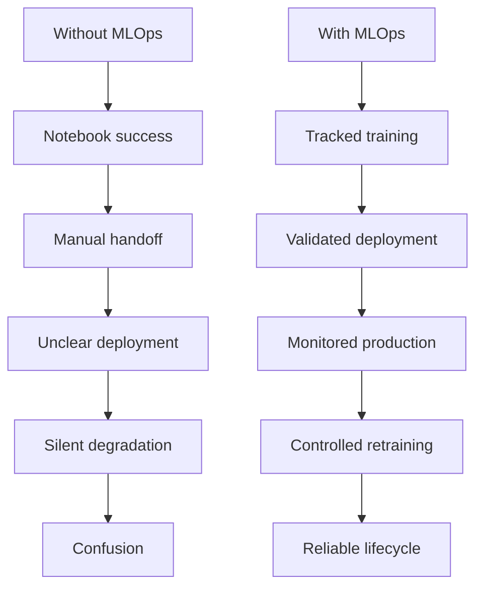

<a id="top"></a>

# MLOps — What It Is, Why It Matters, and How It Differs from DevOps

## Table of Contents

| #  | Section                                                   |
| -- | --------------------------------------------------------- |
| 1  | [Introduction to MLOps](#section-1)                       |
| 2  | [What MLOps is used for](#section-2)                      |
| 3  | [Why MLOps became necessary](#section-3)                  |
| 4  | [Difference between DevOps and MLOps](#section-4)         |
| 4a |    ↳ [Why DevOps alone is not enough for ML](#section-4a) |
| 5  | [Main lifecycle of an MLOps system](#section-5)           |
| 6  | [Core components of MLOps](#section-6)                    |
| 7  | [Scenarios without MLOps](#section-7)                     |
| 7a |    ↳ [Scenarios with MLOps](#section-7a)                  |
| 8  | [Simple comparison table: DevOps vs MLOps](#section-8)    |
| 9  | [Appendix — Short summary](#section-9)                    |
| 10 | [Conclusion](#section-10)                                 |

---

<a id="section-1"></a>

<details>
<summary>1 - Introduction to MLOps</summary>

<br/>

**MLOps** stands for **Machine Learning Operations**.

It is the discipline used to manage the **full lifecycle of machine learning systems** in a reliable, repeatable, and organized way.

A machine learning project does not end when a model is trained. After training, the model still needs to be:

* validated;
* deployed;
* monitored;
* updated;
* retrained when necessary;
* governed over time.

That is exactly where MLOps becomes important.



MLOps is not just about building a model.
It is about making sure the model can **work in the real world**, continue to perform well, and remain manageable over time.

</details>

<p align="right"><a href="#top">↑ Back to top</a></p>

---

<a id="section-2"></a>

<details>
<summary>2 - What MLOps is used for</summary>

<br/>

MLOps is used to turn machine learning from a one-time experiment into a **real production system**.

Its purpose is to help teams:

* move models from notebooks to production;
* keep track of model versions;
* connect models to data pipelines;
* monitor model quality after deployment;
* detect performance degradation;
* retrain models when the data changes;
* keep the whole process reproducible.

In simple words, MLOps is used to answer questions like these:

* Which model is currently running in production?
* Which dataset was used to train it?
* Which code version created it?
* Is the model still performing well today?
* Has the input data changed?
* Do we need to retrain it?

Without MLOps, a model may work once during testing but become difficult to trust, maintain, or improve later.

</details>

<p align="right"><a href="#top">↑ Back to top</a></p>

---

<a id="section-3"></a>

<details>
<summary>3 - Why MLOps became necessary</summary>

<br/>

Traditional software systems mostly depend on **code written by developers**.

Machine learning systems are different because their behavior depends on several elements at the same time:

* the code;
* the training data;
* the feature engineering logic;
* the hyperparameters;
* the trained model artifact;
* the real-world data seen after deployment.

This creates new difficulties.

For example:

* the model may perform well in testing but poorly in production;
* the production data may look different from the training data;
* teams may forget which model version was deployed;
* two people may train the same project and obtain different results;
* performance may slowly decline without obvious errors.

This is why MLOps became necessary.
It introduces structure, traceability, monitoring, and operational discipline into machine learning work.

</details>

<p align="right"><a href="#top">↑ Back to top</a></p>

---

<a id="section-4"></a>

<details>
<summary>4 - Difference between DevOps and MLOps</summary>

<br/>

This is one of the most important ideas to understand.

**DevOps** focuses on the lifecycle of **software applications**.
**MLOps** focuses on the lifecycle of **machine learning systems**.

Both aim for automation, reliability, and faster delivery, but they do not manage the same kind of system.

---

### DevOps

DevOps is mainly concerned with:

* source code;
* application builds;
* automated testing;
* deployment pipelines;
* infrastructure automation;
* monitoring of application availability and performance.

In DevOps, the application logic is explicitly written by developers.

---

### MLOps

MLOps includes some DevOps ideas, but it must also manage:

* datasets;
* model training;
* experiment tracking;
* model evaluation;
* model packaging;
* model serving;
* drift detection;
* retraining workflows.

In MLOps, part of the system behavior is **learned from data**, not only coded by hand.

That is the key difference.



So the difference can be summarized like this:

* **DevOps** manages software delivery.
* **MLOps** manages machine learning delivery and maintenance.

</details>

<p align="right"><a href="#top">↑ Back to top</a></p>

---

<a id="section-4a"></a>

<details>
<summary>4a - Why DevOps alone is not enough for ML</summary>

<br/>

DevOps is extremely useful, but by itself it does not fully solve machine learning problems.

Here is why.

In a normal software project, if the code does not change, the system behavior is usually expected to stay stable.

In machine learning, even when the code stays the same, the behavior may still change because:

* the training data changed;
* the incoming production data changed;
* the target patterns evolved;
* the model was retrained with different parameters;
* the relationship between inputs and outputs drifted over time.

This means ML systems must manage more than deployment.

They must also manage:

* **data lineage**;
* **model lineage**;
* **training reproducibility**;
* **performance over time**;
* **continuous retraining decisions**.

A DevOps pipeline may answer:

* Did the application build correctly?
* Did the tests pass?
* Was the service deployed?

But an MLOps pipeline must also answer:

* Was the model trained on approved data?
* Did the model meet evaluation thresholds?
* Is the model becoming less accurate in production?
* Should the model be retrained?
* Can we trace this prediction back to a specific model version?

That is why MLOps is not a replacement for DevOps.
It is an **extension of operational thinking for machine learning systems**.

</details>

<p align="right"><a href="#top">↑ Back to top</a></p>

---

<a id="section-5"></a>

<details>
<summary>5 - Main lifecycle of an MLOps system</summary>

<br/>

An MLOps system usually follows a continuous lifecycle.


Each stage has a purpose.

| Stage            | Theoretical role                        |
| ---------------- | --------------------------------------- |
| Business problem | define the objective and value          |
| Data collection  | gather the raw information needed       |
| Data preparation | clean, transform, validate, organize    |
| Training         | learn patterns from data                |
| Evaluation       | measure quality and readiness           |
| Deployment       | make the model available in production  |
| Monitoring       | observe predictions and system behavior |
| Retraining       | update the model when needed            |

The important idea is that ML systems are not static.
They must be maintained as living systems.

</details>

<p align="right"><a href="#top">↑ Back to top</a></p>

---

<a id="section-6"></a>

<details>
<summary>6 - Core components of MLOps</summary>

<br/>

MLOps is usually built around several conceptual components.

| Component            | Purpose                                         |
| -------------------- | ----------------------------------------------- |
| Data pipeline        | moves and prepares data                         |
| Training pipeline    | automates model training                        |
| Experiment tracking  | records runs, parameters, and metrics           |
| Model registry       | stores approved model versions                  |
| Deployment mechanism | serves the model in production                  |
| Monitoring layer     | tracks performance and data changes             |
| Governance layer     | controls approval, traceability, and compliance |

These components help organizations answer operational questions clearly.

For example:

* Which model version is approved?
* Which metrics justified deployment?
* When was the model retrained?
* What changed between version 1 and version 2?
* Is the model still reliable today?

</details>

<p align="right"><a href="#top">↑ Back to top</a></p>

---

<a id="section-7"></a>

<details>
<summary>7 - Scenarios without MLOps</summary>

<br/>

The easiest way to understand **why MLOps matters** is to imagine what happens when it is missing.

---

### Scenario 1 — A model works in a notebook but fails in production

A data scientist builds a customer churn model in a notebook.
The evaluation looks excellent, so the team decides to use it.

Later, the engineering team deploys the model into an application, but the predictions become inconsistent.

Why?

Because:

* the production data format is slightly different;
* one feature is missing;
* the preprocessing steps used during training were not packaged correctly;
* nobody documented the exact training pipeline.

Without MLOps, the project becomes dependent on manual memory and informal handoffs.

**Result:**
the model looked successful in development, but the organization cannot run it reliably in the real system.

---

### Scenario 2 — Nobody knows which model is in production

A company trains several fraud detection models over two months.

Different team members test different versions.
One model is deployed, then another replaces it, but the team does not maintain a proper registry.

Later, management asks:

* Which model is currently active?
* Which dataset was used?
* Why are predictions different from last month?

Nobody can answer with certainty.

**Result:**
the team loses traceability and trust.
Even a good model becomes difficult to defend or improve.

---

### Scenario 3 — Model performance drops silently

A recommendation model was trained on last year's user behavior.

At first, it performs well.
Months later, user habits change, but the team has no monitoring for prediction quality or data drift.

The application still runs.
There is no crash.
There is no obvious system error.

But the recommendations are now weaker and less relevant.

**Result:**
the system appears healthy from a software perspective, but it is failing from a machine learning perspective.

This is a major reason why DevOps alone is not enough.

---

### Scenario 4 — Retraining creates confusion

A team decides to retrain a demand forecasting model with newer data.

The new model gives different results than the old one.
However:

* the training parameters were not recorded;
* the dataset version was not saved;
* the feature engineering logic changed slightly;
* no formal comparison process exists.

Now the team cannot explain whether the new model is truly better or just different.

**Result:**
retraining becomes risky instead of useful.

---

### Scenario 5 — A good model cannot be audited

A model is used to support important business decisions.

Later, an internal review asks:

* who approved this model;
* what tests were performed;
* when it was deployed;
* what its known limitations were.

Without MLOps practices such as documentation, approval flow, and version tracking, the team cannot provide clear answers.

**Result:**
the issue is no longer only technical.
It becomes an organizational and governance problem.

</details>

<p align="right"><a href="#top">↑ Back to top</a></p>

---

<a id="section-7a"></a>

<details>
<summary>7a - Scenarios with MLOps</summary>

<br/>

Now let us look at the same type of situations when **MLOps is in place**.

---

### Scenario 1 — The model moves from notebook to production correctly

The team trains a churn prediction model, but this time the preprocessing steps, feature logic, model artifact, and evaluation results are stored in a controlled pipeline.

Before deployment:

* the input schema is validated;
* the model package includes preprocessing logic;
* the serving environment matches the training assumptions;
* the deployment step is standardized.

**Result:**
the model behaves consistently between experimentation and production.

This is one of the clearest benefits of MLOps:
it closes the gap between a notebook result and a production result.

---

### Scenario 2 — The deployed model is always identifiable

A model registry is used.

Each model version has:

* a version number;
* associated metrics;
* a training dataset reference;
* a code reference;
* a deployment status.

When someone asks which model is in production, the answer is immediate.

**Result:**
the team gains traceability, accountability, and confidence.

Instead of saying, “I think version B is deployed,”
they can say, “Version 2.3 is deployed, trained on dataset X, approved on this date.”

---

### Scenario 3 — Performance degradation is detected early

A recommendation model is deployed with monitoring rules.

The system tracks:

* input data distribution;
* prediction behavior;
* business KPIs related to model usefulness;
* possible drift signals.

When the real-world data starts changing, alerts appear.
The team investigates and schedules retraining.

**Result:**
the model is maintained proactively instead of failing silently.

This is why MLOps matters so much:
it helps teams realize that a model can degrade even when the application itself is still technically running.

---

### Scenario 4 — Retraining becomes controlled and comparable

A forecasting model is retrained on fresh data through a formal training pipeline.

The team can compare:

* previous dataset vs new dataset;
* previous hyperparameters vs new hyperparameters;
* previous metrics vs new metrics;
* previous model version vs candidate model version.

Only if the new model satisfies defined conditions is it promoted.

**Result:**
retraining becomes a disciplined improvement process, not a confusing experiment.

---

### Scenario 5 — Governance and review become possible

A model used in production is documented and registered.

The team can show:

* when it was trained;
* which tests were passed;
* which version is active;
* who approved deployment;
* what known limits were identified.

**Result:**
the organization can explain and defend its ML system clearly.

This is especially important when machine learning becomes part of real decision-making processes.

---

### Short interpretation

Without MLOps, teams often say:

* “The model worked on my machine.”
* “We are not sure which version is live.”
* “The system is running, so it must be fine.”
* “We retrained it, but we do not know what changed.”

With MLOps, teams can say:

* “This exact version is deployed.”
* “These metrics justified release.”
* “Drift was detected last week.”
* “Retraining was triggered with controlled data and tracked results.”

That difference explains **why MLOps exists**.



</details>

<p align="right"><a href="#top">↑ Back to top</a></p>

---

<a id="section-8"></a>

<details>
<summary>8 - Simple comparison table: DevOps vs MLOps</summary>

<br/>

| Aspect                  | DevOps                                    | MLOps                                                        |
| ----------------------- | ----------------------------------------- | ------------------------------------------------------------ |
| Main focus              | software applications                     | machine learning systems                                     |
| Core asset              | source code                               | code + data + model                                          |
| Main goal               | reliable software delivery                | reliable model delivery and lifecycle management             |
| Testing focus           | code correctness, integration, deployment | code + data quality + model quality + production behavior    |
| Change source           | mostly code changes                       | code changes, data changes, model changes                    |
| Monitoring focus        | uptime, logs, latency, errors             | uptime, latency, prediction quality, data drift, model drift |
| Release artifact        | application package or container          | trained model plus serving system                            |
| Retraining need         | usually not relevant                      | often essential                                              |
| Reproducibility concern | build reproducibility                     | experiment, data, training, and model reproducibility        |
| Extra challenge         | infrastructure complexity                 | infrastructure + data evolution + statistical uncertainty    |

---

### Short interpretation

DevOps asks:
**Can we build, test, and deploy this application reliably?**

MLOps asks:
**Can we build, train, validate, deploy, monitor, and maintain this learning system reliably over time?**

</details>

<p align="right"><a href="#top">↑ Back to top</a></p>

---

<a id="section-9"></a>

<details>
<summary>9 - Appendix — Short summary</summary>

<br/>

```text
MLOps = Machine Learning Operations

What it is used for:
- deploying ML models
- tracking versions
- monitoring prediction quality
- detecting drift
- retraining models
- keeping ML systems reliable over time

Main difference from DevOps:
DevOps manages software operations.
MLOps manages machine learning operations.

Why they are different:
Software depends mostly on code.
ML systems depend on code + data + trained models.

Why MLOps matters:
A model can degrade even if the code does not change.
Therefore ML systems need monitoring, traceability, and retraining.

Simple intuition:
Without MLOps, ML stays fragile and hard to trust.
With MLOps, ML becomes manageable as a real production system.
```

</details>

<p align="right"><a href="#top">↑ Back to top</a></p>

---

<a id="section-10"></a>

<details>
<summary>10 - Conclusion</summary>

<br/>

MLOps is the operational discipline that makes machine learning usable at real scale.

Its purpose is not simply to train models, but to make sure they can be:

* deployed properly;
* tracked clearly;
* monitored continuously;
* improved safely over time.

The biggest difference between **DevOps** and **MLOps** is that DevOps manages systems whose behavior is mainly defined by code, while MLOps manages systems whose behavior depends on **code, data, and trained models**.

The scenarios above make the reason very clear:

* **without MLOps**, machine learning often remains fragile, manual, and difficult to trust;
* **with MLOps**, machine learning becomes structured, traceable, monitored, and maintainable.

That is why MLOps is needed.

</details>

<p align="right"><a href="#top">↑ Back to top</a></p>

